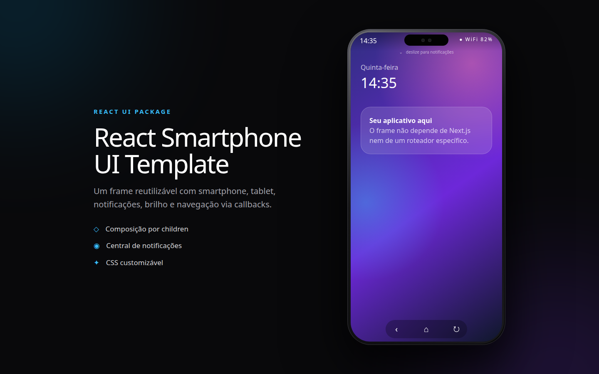

<p align="center">
  
</p>

# 📱 React Smartphone UI


Biblioteca de componentes React com TypeScript para apresentar qualquer aplicação dentro de um frame de dispositivo reutilizável e responsivo, com modos smartphone e tablet.

O componente inclui central de notificações, controle de brilho, indicadores de status e navegação por callbacks, sem depender de Next.js ou de um roteador específico.

## ✨ Recursos

- Modos **smartphone** e **tablet** com rotação em tempo real.
- Escala responsiva de acordo com o espaço disponível.
- Conteúdo livre por composição com `children`.
- Central de notificações interativa.
- Controle de brilho da tela.
- Indicadores de bateria, conexão e horário.
- Botões de voltar, início e rotação por callbacks.
- Estilos CSS que podem ser sobrescritos pela aplicação consumidora.
- Tipos TypeScript exportados junto com a biblioteca.

## 📦 Instalação

Adicione o pacote ao seu projeto com pnpm:

```bash
pnpm add @mateusjrcavalcanti/react-smartphone-ui
```

O React e o React DOM são dependências pares e devem estar disponíveis na aplicação:

```bash
pnpm add react react-dom
```

## 🚀 Uso

Importe o componente e a folha de estilos da biblioteca:

```tsx
import { DevicePreview } from "@mateusjrcavalcanti/react-smartphone-ui";
import "@mateusjrcavalcanti/react-smartphone-ui/styles.css";

const notifications = [
  {
    id: "welcome",
    app: "Meu app",
    title: "Olá!",
    message: "Esta é uma notificação de exemplo.",
    color: "#38bdf8",
  },
];

export function Preview() {
  return (
    <DevicePreview
      notifications={notifications}
      onHome={() => navigate("/")}
      onBack={() => history.back()}
    >
      <MinhaAplicacao />
    </DevicePreview>
  );
}
```

Integrações de rota ficam sob responsabilidade da aplicação consumidora por meio de `onHome`, `onBack` e dos demais callbacks.

## 🧩 Componentes

### `DevicePreview`

Componente recomendado para demonstrações responsivas. Ele controla a escala e alterna automaticamente entre os modos smartphone e tablet quando o botão de rotação é acionado.

| Propriedade | Tipo | Padrão | Descrição |
| --- | --- | --- | --- |
| `initialMode` | `"smartphone" \| "tablet"` | `"smartphone"` | Modo inicial do dispositivo. |
| `responsive` | `boolean` | `true` | Ajusta a escala ao espaço disponível. |
| `notifications` | `SmartphoneNotification[]` | `[]` | Notificações exibidas na central. |
| `batteryLevel` | `number` | `82` | Porcentagem mostrada no indicador de bateria. |
| `online` | `boolean` | `true` | Define o estado do indicador de conexão. |
| `onBack` | `() => void` | — | Executado ao pressionar o botão voltar. |
| `onHome` | `() => void` | — | Executado ao pressionar o botão início. |

### `SmartphoneFrame`

Componente de nível mais baixo para controlar diretamente o modo e a rotação do dispositivo. Ele recebe as mesmas propriedades visuais e de interação, além de `deviceMode` e `onRotate`.

## 🔔 Notificações

Cada item da central segue o tipo `SmartphoneNotification`:

```ts
type SmartphoneNotification = {
  id: string;
  app: string;
  title: string;
  message: string;
  time?: string;
  color?: string;
};
```

A central pode ser aberta com um clique na barra de status ou com um gesto vertical sobre ela. Ao remover uma notificação, `onNotificationsChange` recebe a nova lista.

## 🧰 Tecnologias

- **React** para composição dos componentes.
- **TypeScript** para tipos e segurança estática.
- **Vite** para desenvolvimento e build da biblioteca.
- **Tailwind CSS** e CSS próprio para apresentação.
- **Lucide React** para os ícones da interface.
- **pnpm** para gerenciamento de dependências.

## 💻 Desenvolvimento

Instale as dependências e inicie a aplicação de exemplo:

```bash
pnpm install
pnpm dev
```

Para verificar os tipos:

```bash
pnpm typecheck
```

## 🏗️ Build da biblioteca

Gere os arquivos JavaScript, CSS e as declarações TypeScript em `dist`:

```bash
pnpm build -- --mode library
```

## 🌐 GitHub Pages

A aplicação de exemplo é publicada automaticamente pelo workflow **Deploy GitHub Pages** a cada push na branch `main`. O caminho base do Vite é calculado a partir do nome do repositório durante o build.

Para testar localmente o mesmo build usado na publicação:

```bash
pnpm build:pages
pnpm preview
```

Na primeira publicação, habilite o Pages por uma destas opções:

1. Acesse **Settings → Pages** e configure **Source** como **GitHub Actions**; ou
2. crie um Personal Access Token com escopo `repo`, salve-o em **Settings → Secrets and variables → Actions** com o nome `PAGES_TOKEN` e deixe o workflow habilitar o Pages automaticamente.

O secret é opcional depois que o Pages estiver habilitado. Também é possível iniciar uma nova publicação manualmente pela aba **Actions**.

## 📁 Estrutura

```text
src/
  demo/                 aplicação de exemplo
  lib/
    device-preview.tsx  preview responsivo
    smartphone-frame.tsx
    types.ts            API TypeScript
  index.ts              exports da biblioteca
  styles.css            estilos dos componentes
assets/
  cover.png             capa do projeto
.github/workflows/
  deploy-pages.yml      publicação no GitHub Pages
```
